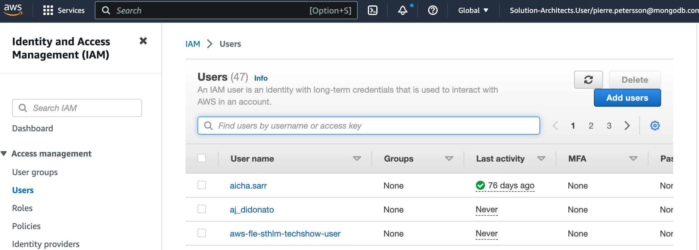

# How to setup and configure AWS IAM user
The IAM user will be used to be able to automate proc

## 1 - Create an IAM User
Log in to your AWS Console, and go to AWS IAM Service. Create a new user se steps below.

 

## 2 - Specify user name
Just use the default settings and create user

## 3 - Create Inline Policy
Add an inline policy on your newly created user

## 4 - Import managed Policy 
Next is to import a managed policy, click on the link in the right corner which states "Import Managed Policy"

## 5 - Select Administrator Policy
Select AdministratorAccess and import

## 6 - Create AccessKeys

## 7 - Create access keys
Copy access keys to be used when configuring FLE demo

## 8 - Copy access keys
Copy access keys to be used when configuring FLE demo

